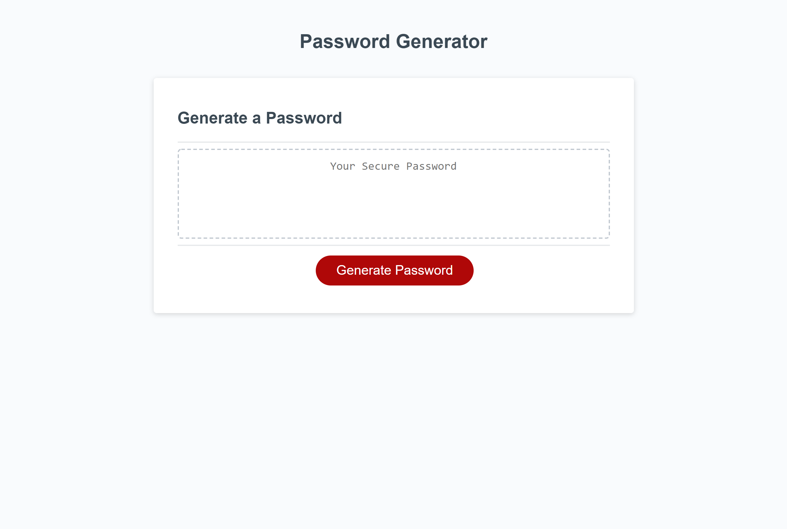

Greetings!

Thank you for checking out my password generator!

This app can be utilized to generate your own randomized password for increased security.
Most of the heavy lifting in this app was done through javascript.  This app received 
input from the user to determine length of the password and which characters.

This information is then taken and a randomized character is retrieved for each index 
until a fully formed password is developed.  This password is then constituted into a string
and displayed for the reader to see.  I hope you enjoy, thank you!

You can find this project at
https://yippeejimmee.github.io/PasswordGenerator/

